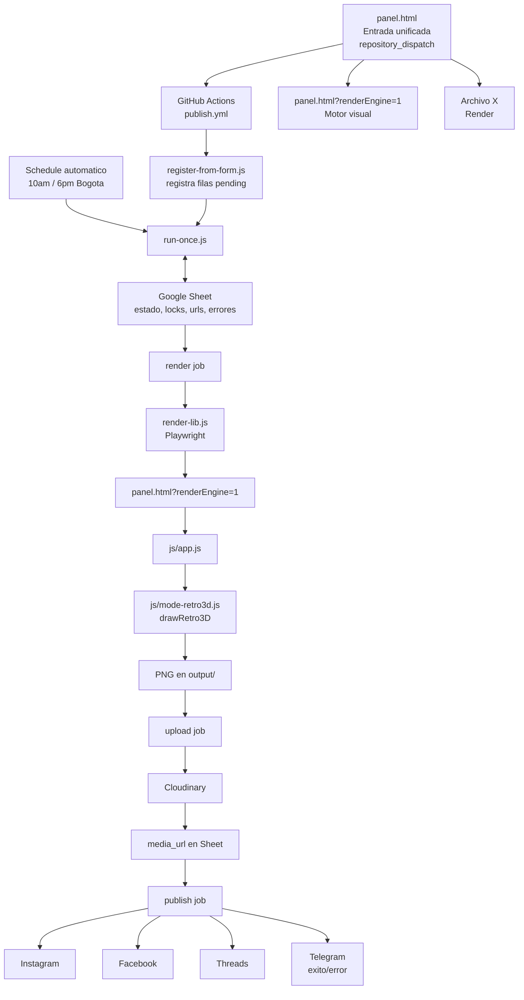
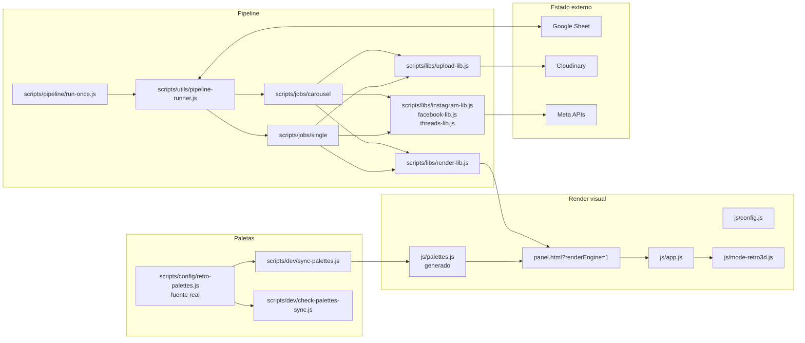

# Mapa del proyecto

Esta guia es para entender que piezas existen, como se conectan y por donde conviene atacar cambios sin romper el pipeline.

## Idea central

El proyecto publica frases como imagenes retro 3D en Instagram, Facebook y Threads. Todo pasa por Google Sheets: no hay base de datos ni estado compartido entre procesos.



## Fuente de verdad visual

El render real de produccion sale de `panel.html?renderEngine=1` + `js/` (`index.html` fue
eliminado en la Fase C7B). Los `onload` de watermark/logo en `js/config.js` llaman `draw()` con
un guard (`typeof draw === "function"`), porque `draw` la define `js/app.js` mas tarde en la
cadena de carga — sin el guard aparecia un `ReferenceError` inofensivo en consola. No quitar
ese guard; el render final no depende de ese repaint temprano.

```txt
panel.html?renderEngine=1
  -> js/app.js
    -> draw()
      -> drawRetro3D()
        -> layoutTextBalanced()
        -> drawRetro3DLine()
```

Si quieres cambiar como se ve la imagen publicada, normalmente se toca:

```txt
js/mode-retro3d.js
js/config.js
scripts/config/retro-palettes.js
```

Verificacion base para cambios visuales:

```powershell
node --check js/mode-retro3d.js
node scripts/dev/render-preview.js "Creen que me voy a quedar callada pero toda la vida me han reganado por contestona" retro3d "#D4A017"
npm run check-palettes-sync
```

## Tres planos de despliegue

El proyecto vive en tres planos distintos. La confusion normal viene de que los tres se ven como "paginas", pero no hacen lo mismo.

```mermaid
flowchart TD
  A[GitHub Pages<br/>HTML estatico] --> B[panel.html]
  B --> C[Publicar Ahora / Operaciones<br/>repository_dispatch]
  B --> D[panel.html?renderEngine=1<br/>motor visual]
  B --> G[/api/phrases]
  B --> H[/api/plan-carruseles]

  E[Render<br/>Node server] --> F[Redirect 302<br/>panel.html#curate]
  E --> G[/api/phrases]
  E --> H[/api/plan-carruseles]

  I[GitHub Actions] --> J[pipeline publish.yml]
  J --> D
  J --> K[Google Sheet]
  J --> L[Cloudinary]
  J --> M[Meta APIs]
```

Reglas:

```txt
GitHub Pages: interfaz estatica unificada y preview.
Render: backend/API de Archivo X.
GitHub Actions: publicacion real y metricas por schedule o repository_dispatch
(publish.yml: publish-posts; metrics.yml: update-metrics; ninguno tiene workflow_dispatch).
El panel ademas lee el historial de runs de ambos workflows por API
(Historial de ejecuciones en Operaciones; si la consulta de un workflow falla,
muestra los runs del otro con una advertencia, y los errores 401/403/404 de la
API de GitHub se reportan con mensajes claros).
panel.html: puerta de entrada diaria; con ?renderEngine=1 es tambien el motor de render real
(index.html fue eliminado en la Fase C7B).
```

## Piezas principales



## Que esta entrelazado

### Paletas

Fuente real:

```txt
scripts/config/retro-palettes.js
```

Mirror generado:

```txt
js/palettes.js
```

Regla: no editar `js/palettes.js` a mano. Si cambias paletas:

```powershell
npm run sync-palettes
npm run check-palettes-sync
```

### Render retro 3D

Config global:

```txt
js/config.js
```

Renderer:

```txt
js/mode-retro3d.js
```

Entrada del modo:

```txt
js/app.js
```

`app.js` llama `drawRetro3D()` cuando `mode === "retro3d"`.

### Panel y preview manual

`panel.html` es la entrada unificada. Contiene la UI de publicar y la UI nativa de Archivo X.

La previsualizacion del panel usa un `iframe` oculto con `panel.html?renderEngine=1` y `postMessage`, para pedirle al render real un PNG.

Flujo:

```txt
panel.html
  -> iframe panel.html?renderEngine=1
    -> js/app.js escucha render-request
    -> draw()
    -> canvas.toDataURL()
  <- panel.html pinta el PNG en su canvas local
```

Esto es bueno porque evita mantener dos renderers distintos.

Archivo X no se muestra dentro de un iframe visible. El panel llama directamente al backend de Render:

```txt
panel.html
  -> GET/PATCH /api/phrases
  -> GET/POST /api/plan-carruseles
  -> Google Sheet archivo_x / Hoja 2
```

El tab Agregar Frases incluye ademas un OCR local de pantallazos (tesseract.js vendoreado en
`vendor/tesseract/`, versiones pineadas en `VERSIONS.txt`, carga lazy). Las imagenes se procesan
solo en el navegador (no van a ninguna API ni se guardan) y el resultado son frases candidatas
que el usuario revisa y agrega al textarea; el guardado sigue siendo el mismo
`POST /api/raw-phrases`. No cambiar ese vendor por un CDN sin decision explicita.
En pantallazos verticales (TikTok/Reels/Shorts) el checkbox "Priorizar zona central" (default
on) recorta tabs/botones/navegacion antes del OCR y cae a imagen completa solo si el recorte no
da candidatas utiles; la limpieza filtra UI social, audio/cancion, hashtags y contadores, y
prioriza frases con "decia:", comillas o puntuacion clara. La calidad sigue dependiendo de la
imagen: siempre revisar las candidatas antes de guardar.

### Estado y locks

El Sheet guarda:

```txt
estado_general
estado_render
estado_upload
estado_publish
lock_status
row_id
carousel_id
media_url
cloudinary_public_id
instagram_error
facebook_error
threads_error
```

Zona delicada:

```txt
scripts/core/status.js
scripts/core/sheets.js
scripts/utils/pipeline-utils.js
scripts/utils/pipeline-runner.js
scripts/jobs/**/*
```

Regla mental: si cambias locks, estados o columnas, prueba con mas calma.

## Donde tocar segun el cambio

| Quiero cambiar | Tocar primero | Verificar |
| --- | --- | --- |
| Look del post retro 3D | `js/mode-retro3d.js`, `js/config.js` | render preview + `node --check` |
| Paletas | `scripts/config/retro-palettes.js` | `sync-palettes` + `check-palettes-sync` |
| Preview del formulario | `panel.html`, `js/app.js` | probar panel local + render preview |
| Render desde Node/Playwright | `scripts/libs/render-lib.js`, `scripts/dev/render-preview.js` | `npm run render` |
| Registro desde formulario | `scripts/pipeline/register-from-form.js`, workflow | `npm run doctor` |
| Orden del pipeline | `scripts/pipeline/run-once.js`, `scripts/utils/pipeline-runner.js` | `npm run doctor` |
| Upload | `scripts/libs/upload-lib.js` | `npm run doctor` + prueba controlada |
| Instagram/Facebook/Threads | `scripts/libs/*-lib.js`, jobs publish | `npm run doctor` + revisar errores por plataforma |
| Archivo X | `panel.html`, `scripts/dev/archive-curator-server.js`, `scripts/jobs/inspiration/*` | probar `panel.html#curate` + `npm run curate:archivo-x` |
| Sheet/locks/estados | `scripts/core/*`, `scripts/utils/pipeline-utils.js`, jobs | `npm run doctor` + `npm run doctor:sheet` |

## Mapa de riesgo

### Riesgo bajo

```txt
docs/*
comentarios
scripts/dev/* no usados por produccion
limpieza de archivos sin referencias confirmadas por rg
```

Verificacion:

```powershell
npm run doctor
```

### Riesgo medio

```txt
js/mode-retro3d.js
js/config.js
panel.html
scripts/config/retro-palettes.js
scripts/dev/render-preview.js
```

Verificacion:

```powershell
node --check js/mode-retro3d.js
node scripts/dev/render-preview.js "Creen que me voy a quedar callada pero toda la vida me han reganado por contestona" retro3d "#D4A017"
npm run check-palettes-sync
```

### Riesgo alto

```txt
scripts/pipeline/*
scripts/jobs/*
scripts/utils/pipeline-runner.js
scripts/utils/pipeline-utils.js
scripts/core/status.js
scripts/core/sheets.js
```

Verificacion:

```powershell
npm run doctor
npm run doctor:sheet
```

### Riesgo muy alto

```txt
lock_status
releaseStaleLocks
estado_general
publish_only
unlock_id
reintentar
Meta Graph API
columnas del Sheet
```

Antes de tocar esto, conviene hacer un plan corto y probar con un solo `row_id` o `carousel_id`.

## Ritual antes de modificar

1. Mirar el estado del repo:

```powershell
git status --short
```

2. Buscar referencias antes de borrar o renombrar:

```powershell
rg -n "nombreFuncion|nombreArchivo|comando" . --glob "!node_modules/**" --glob "!.git/**"
```

3. Cambiar una cosa por vez.

4. Verificar segun el tipo de cambio.

5. Revisar diff:

```powershell
git diff --stat
git diff -- nombre/del/archivo
```

## Checklist por tipo de cambio

### Cambio visual retro 3D

```powershell
node --check js/mode-retro3d.js
node scripts/dev/render-preview.js "Creen que me voy a quedar callada pero toda la vida me han reganado por contestona" retro3d "#D4A017"
npm run check-palettes-sync
```

Tambien revisar:

```powershell
rg -n "drawRetro3D|layoutTextBalanced|drawRetro3DLine" js scripts panel.html
```

### Cambio de paletas

```powershell
npm run sync-palettes
npm run check-palettes-sync
node scripts/dev/render-preview.js "Prueba de color" retro3d "#D4A017"
```

### Cambio de pipeline

```powershell
npm run doctor
npm run doctor:sheet
```

Revisar especialmente:

```txt
locks
estado_general
estado_render/upload/publish
intentos
error_step
error_message
```

### Cambio en `panel.html`

Revisar que el preview siga usando el render real:

```txt
iframe panel.html?renderEngine=1
render-request
render-response
canvas.toDataURL()
```

No volver a copiar funciones de `js/mode-retro3d.js` dentro de `panel.html`.

## Orden recomendado para limpiar o mejorar

1. Documentacion y scripts dev.
2. Preview y herramientas locales.
3. Render visual.
4. Paletas.
5. Archivo X.
6. Pipeline de render/upload/publish.
7. Locks, estados y Sheet.

La idea es ir de lo reversible a lo delicado.
